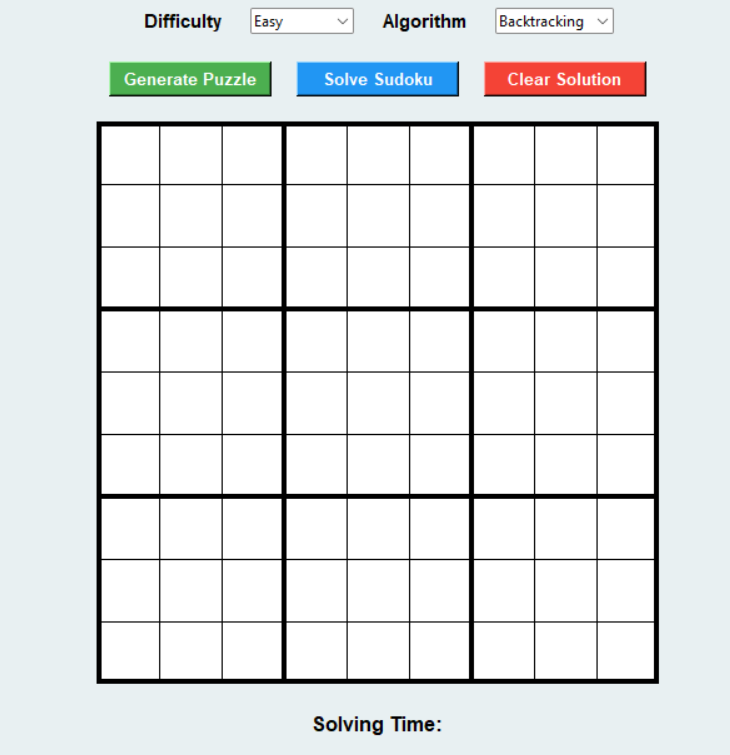
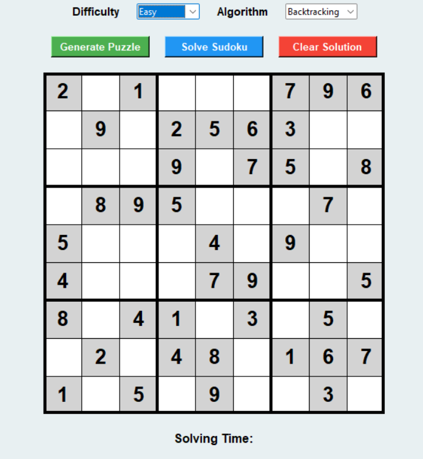
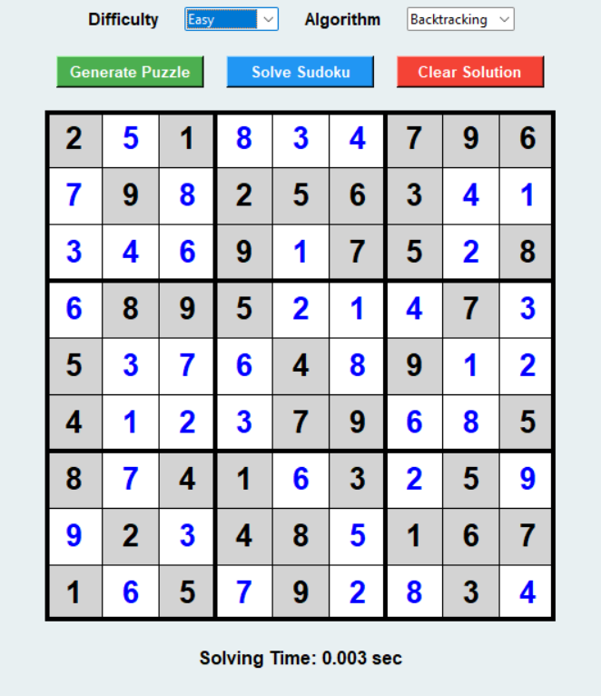
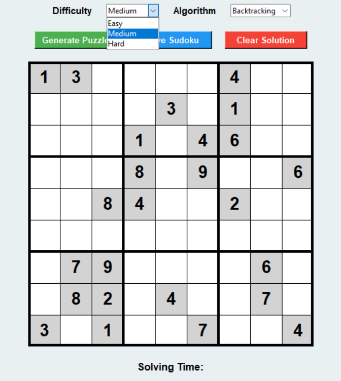
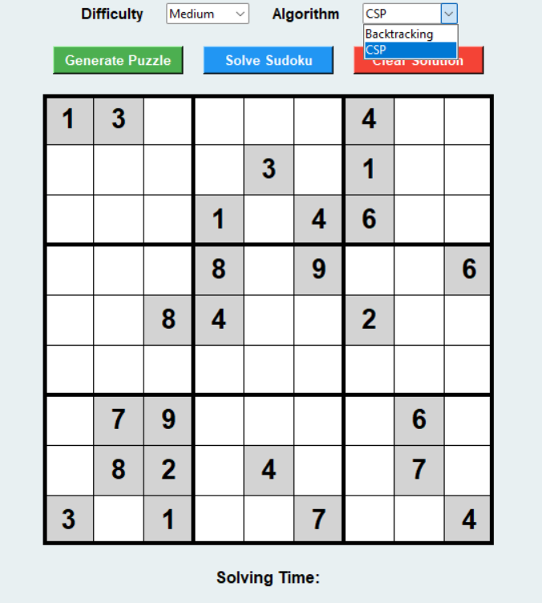

# AI Sudoku Solver

A GUI-based Sudoku Generator and Solver built using Python and Tkinter.

## Features

- Generate Sudoku puzzles
- Easy, Medium, and Hard difficulty levels
- Solve puzzles using Backtracking
- Solve puzzles using CSP (Constraint Satisfaction Problem)
- Real-time solving animation
- Solving time comparison

## Technologies Used

- Python
- Tkinter
- Backtracking Algorithm
- Constraint Satisfaction Problem (CSP)

## How to Run

1. Install Python
2. Download or clone this repository
3. Open a terminal in the project folder
4. Run:

```bash
python Sudoku.py
```

## Screenshots

### Empty Sudoku Board


### Generated Sudoku


### Solved Sudoku


### Difficulty Selection


### Algorithm Selection


## Learning Outcomes

- Learned recursive Backtracking algorithms
- Learned Constraint Satisfaction Problem (CSP) concepts
- Built a GUI application using Tkinter
- Improved Python programming and problem-solving skills
